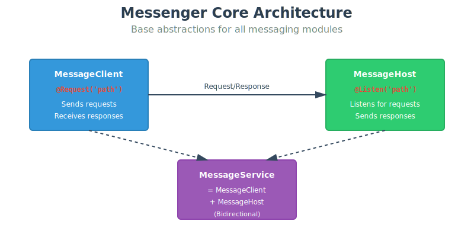
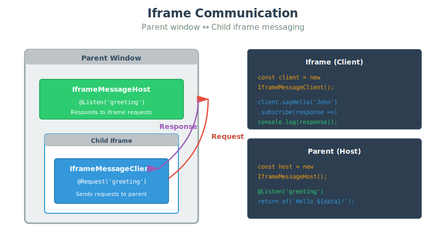
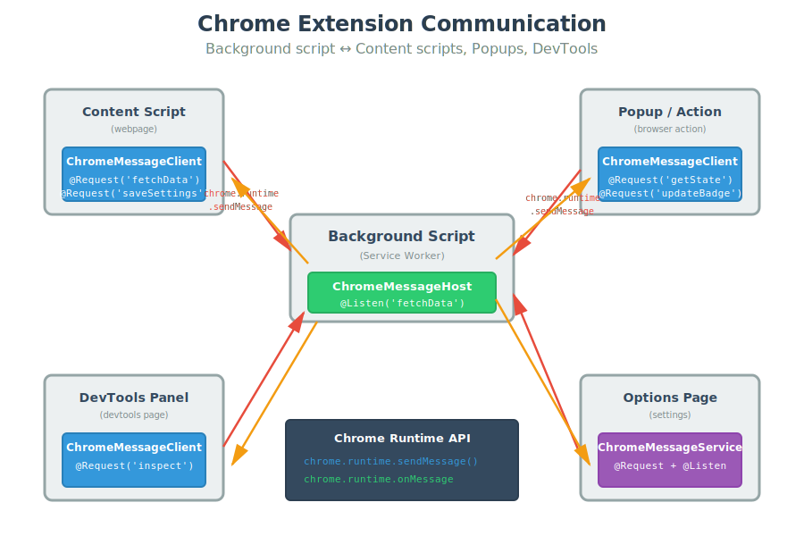
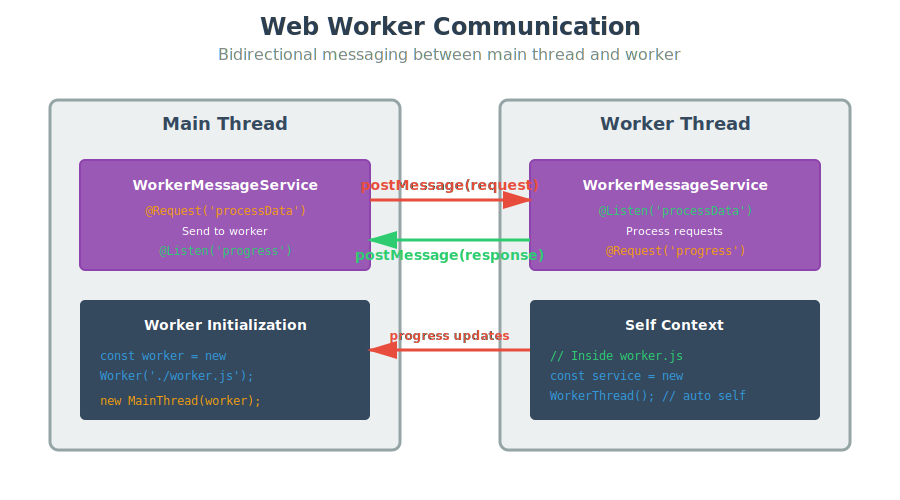
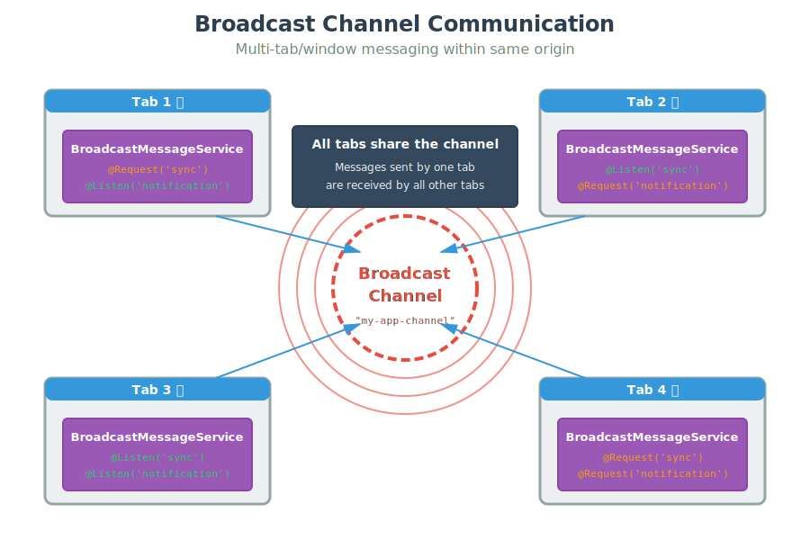

# @telperion/messenger

[](https://www.npmjs.com/package/@telperion/messenger)
[](https://www.npmjs.com/package/@telperion/messenger)
[](https://app.codecov.io/gh/telperiontech/telperion/tree/main?flags%5B0%5D=messenger)
[](https://www.typescriptlang.org/)
[](https://opensource.org/licenses/MIT)

Javascript messaging library for cross-context communication

**Part of the [Telperion](https://github.com/telperiontech/telperion) monorepo**

## Installation

```bash
npm install @telperion/messenger
# or
yarn add @telperion/messenger
# or
pnpm add @telperion/messenger
```

## Overview

Messenger provides a unified, decorator-based API for cross-context messaging in JavaScript applications. Built on RxJS, it supports:

- 🖼️ **Iframe Communication** - Parent-child window messaging
- 🧩 **Chrome Extensions** - Background scripts, content scripts, and popups
- 👷 **Web Workers** - Main thread and worker communication
- 📡 **Broadcast Channel** - Tab-to-tab messaging
- 🔗 **WebRTC DataChannel** - Peer-to-peer messaging over RTCDataChannel

## Core Concepts

### MessageClient & MessageHost

The library uses two main abstractions:

- **`MessageClient`**: Sends requests and receives responses (uses `@Request` decorator)
- **`MessageHost`**: Listens for requests and sends responses (uses `@Listen` decorator)
- **`MessageService`**: Combines both client and host (bidirectional communication)



### Decorators

- **`@Request(path)`**: Marks a method as a message sender
- **`@Listen(path)`**: Marks a method as a message listener

## Usage

### Iframe Communication

Send and receive messages between iframes and parent windows.



#### Client-Only (Iframe)

```typescript
import { IframeMessageClient, Request } from '@telperion/messenger/iframe';
import { Observable } from 'rxjs';

class IframeClient extends IframeMessageClient {
  @Request('greeting')
  sayHello(name: string): Observable<string> {
    return null!; // Implementation handled by decorator
  }
}

// Default: sends messages to parent window
const client = new IframeClient();

// Optional: specify channel name
const clientWithChannel = new IframeClient('my-channel');

// Optional: target specific iframe (from parent window)
const iframe = document.querySelector('iframe');
const clientToIframe = new IframeClient('my-channel', iframe);

// Optional: use a function to get iframe dynamically
const clientWithDynamicIframe = new IframeClient('my-channel', () => 
  document.querySelector('iframe#dynamic')
);

client.sayHello('John').subscribe(response => {
  console.log(response); // 'Hello John!'
});
```

#### Host-Only (Parent Window)

```typescript
import { IframeMessageHost, Listen, UpcomingMessage } from '@telperion/messenger/iframe';
import { of } from 'rxjs';

class ParentHost extends IframeMessageHost {
  @Listen('greeting')
  handleGreeting({ data }: UpcomingMessage<string>): Observable<string> {
    return of(`Hello ${data}!`);
  }
}

// Default: listens to all iframes
const host = new ParentHost();

// Optional: specify channel name
const hostWithChannel = new ParentHost('my-channel');

// Optional: listen only to specific iframe
const iframe = document.querySelector('iframe');
const hostForSpecificIframe = new ParentHost('my-channel', iframe);

// Optional: use a function to get iframe dynamically
const hostWithDynamicIframe = new ParentHost('my-channel', () => 
  document.querySelector('iframe#dynamic')
);
```

#### Bidirectional Communication (MessageService)

```typescript
import { IframeMessageService, Request, Listen } from '@telperion/messenger/iframe';
import { of, Observable } from 'rxjs';

class IframeBidirectional extends IframeMessageService {
  // Send messages
  @Request('getData')
  requestData(): Observable<any> {
    return null!;
  }

  // Receive messages
  @Listen('update')
  handleUpdate(data: any): Observable<string> {
    console.log('Received update:', data);
    return of('Update processed');
  }
}

// Default: communicates with parent window
const service = new IframeBidirectional();

// Optional: specify channel name and target frame
const iframe = document.querySelector('iframe');
const serviceWithTarget = new IframeBidirectional('my-channel', iframe);

// From within iframe (communicates with parent)
const iframeService = new IframeBidirectional('my-channel');
```

---

### Chrome Extensions

Communicate across extension contexts (background, content scripts, popups).



#### Content Script

```typescript
import { ChromeMessageClient, Request } from '@telperion/messenger/chrome';
import { Observable } from 'rxjs';

class ContentScript extends ChromeMessageClient {
  @Request('fetchData')
  getData(query: string): Observable<any> {
    return null!;
  }

  @Request('saveSettings')
  saveSettings(settings: object): Observable<boolean> {
    return null!;
  }
}

const contentScript = new ContentScript();

contentScript.getData('user').subscribe(data => {
  console.log('Received:', data);
});
```

#### Background Script

```typescript
import { ChromeMessageHost, Listen } from '@telperion/messenger/chrome';
import { of, Observable } from 'rxjs';

class BackgroundScript extends ChromeMessageHost {
  @Listen('fetchData')
  handleFetchData(query: string): Observable<any> {
    // Fetch from API or storage
    return of({ name: 'John', age: 30 });
  }

  @Listen('saveSettings')
  handleSaveSettings(settings: object): Observable<boolean> {
    // Save to chrome.storage
    return of(true);
  }
}

const background = new BackgroundScript();
```

---

### Web Workers

Communicate between main thread and web workers.



#### Main Thread

```typescript
import { WorkerMessageService, Request, Listen } from '@telperion/messenger/worker';
import { of, Observable } from 'rxjs';

class MainThread extends WorkerMessageService {
  @Request('processData')
  sendDataToWorker(data: number[]): Observable<number> {
    return null!;
  }

  @Listen('progress')
  handleProgress(percent: number): Observable<void> {
    console.log(`Progress: ${percent}%`);
    return of(void 0);
  }
}

// Must provide Worker instance in main thread
const worker = new Worker('./worker.js');
const mainService = new MainThread(worker);

mainService.sendDataToWorker([1, 2, 3, 4, 5]).subscribe(result => {
  console.log('Worker result:', result);
});
```

##### Flexible Worker Initialization

The worker parameter supports multiple initialization patterns for different use cases:

```typescript
// Direct Worker instance
const service1 = new MainThread(new Worker('./worker.js'));

// Promise that resolves to a Worker (for async initialization)
const workerPromise = import('./worker.js').then(m => new Worker(m.default));
const service2 = new MainThread(workerPromise);

// Function that returns a Worker (for lazy initialization)
const service3 = new MainThread(() => new Worker('./worker.js'));

// Function that returns a Promise<Worker> (for async lazy initialization)
const service4 = new MainThread(async () => {
  const module = await import('./worker.js');
  return new Worker(module.default);
});
```

##### Dynamic Worker Management with `initialize()`

The `initialize()` method allows you to switch workers at runtime or re-establish connections:

```typescript
class MainThread extends WorkerMessageService {
  // ... decorators and methods
}

// Start without a worker
const service = new MainThread();

// Later, connect to a worker dynamically
service.initialize(new Worker('./worker.js'));

// Switch to a different worker
service.initialize(new Worker('./different-worker.js'));

// Re-establish connection after worker error
const worker = new Worker('./worker.js');
worker.onerror = (error) => {
  console.error('Worker error, reinitializing...', error);
  service.initialize(new Worker('./worker.js'));
};
service.initialize(worker);

// Conditional worker initialization
function getWorker() {
  return navigator.hardwareConcurrency > 2 
    ? new Worker('./heavy-worker.js')
    : new Worker('./light-worker.js');
}
service.initialize(getWorker);
```

#### Worker Thread

```typescript
import { WorkerMessageService, Request, Listen } from '@telperion/messenger/worker';
import { of, Observable } from 'rxjs';

class WorkerThread extends WorkerMessageService {
  @Listen('processData')
  handleProcessData(data: number[]): Observable<number> {
    // Heavy computation
    const result = data.reduce((sum, n) => sum + n, 0);
    return of(result);
  }

  @Request('progress')
  reportProgress(percent: number): Observable<void> {
    return null!;
  }
}

// Inside worker: no argument needed (uses self)
const workerService = new WorkerThread();
```

---

### Broadcast Channel

Communicate between different tabs/windows of the same origin.



#### Tab 1

```typescript
import { BroadcastMessageService, Request, Listen } from '@telperion/messenger/broadcast';
import { of, Observable } from 'rxjs';

class Tab1 extends BroadcastMessageService {
  @Request('sync')
  requestSync(data: any): Observable<string> {
    return null!;
  }

  @Listen('notification')
  handleNotification(message: string): Observable<void> {
    console.log('Notification:', message);
    return of(void 0);
  }
}

const tab1 = new Tab1('my-app-channel');

tab1.requestSync({ user: 'John' }).subscribe(response => {
  console.log(response); // 'Sync completed'
});
```

#### Tab 2

```typescript
import { BroadcastMessageService, Request, Listen } from '@telperion/messenger/broadcast';
import { of, Observable } from 'rxjs';

class Tab2 extends BroadcastMessageService {
  @Listen('sync')
  handleSync(data: any): Observable<string> {
    console.log('Syncing data:', data);
    return of('Sync completed');
  }

  @Request('notification')
  sendNotification(message: string): Observable<void> {
    return null!;
  }
}

const tab2 = new Tab2('my-app-channel');
```

---

### WebRTC (RTCDataChannel)

Communicate between peers over a negotiated RTCDataChannel. Both sides create the channel with the same name and a deterministic ID derived via FNV-1a hash, so there is no offer/answer asymmetry for the data channel itself — you only need to provide the `RTCPeerConnection`.


#### Peer A (Client)

```typescript
import { RTCMessageClient, Request } from '@telperion/messenger/rtc';
import { Observable } from 'rxjs';

class PeerA extends RTCMessageClient {
  @Request('move')
  sendMove(position: [number, number]): Observable<boolean> {
    return null!; // Implementation handled by decorator
  }
}

// Provide an RTCPeerConnection
const client = new PeerA(peerConnection);

// Optional: custom channel name
const clientWithChannel = new PeerA(peerConnection, 'game-events');

client.sendMove([3, 4]).subscribe(ok => {
  console.log('Move accepted:', ok);
});
```

#### Peer B (Host)

```typescript
import { RTCMessageHost, Listen } from '@telperion/messenger/rtc';
import { of, Observable } from 'rxjs';

class PeerB extends RTCMessageHost {
  @Listen('move')
  handleMove({ data }: { data: [number, number] }): Observable<boolean> {
    console.log('Move received:', data);
    return of(true);
  }
}

const host = new PeerB(peerConnection);

// Optional: custom channel name (must match the client)
const hostWithChannel = new PeerB(peerConnection, 'game-events');
```

#### Bidirectional Communication (MessageService)

```typescript
import { RTCMessageService, Request, Listen } from '@telperion/messenger/rtc';
import { of, Observable } from 'rxjs';

class GamePeer extends RTCMessageService {
  @Request('move')
  sendMove(position: [number, number]): Observable<boolean> {
    return null!;
  }

  @Listen('move')
  handleMove({ data }: { data: [number, number] }): Observable<boolean> {
    console.log('Opponent moved:', data);
    return of(true);
  }
}

// Both peers use the same class with their own RTCPeerConnection
const peer = new GamePeer(peerConnection, 'game-events');
```

##### Flexible Connection Initialization

The connection parameter supports multiple initialization patterns:

```typescript
// Direct RTCPeerConnection instance
const service1 = new GamePeer(peerConnection);

// Promise that resolves to an RTCPeerConnection
const connPromise = establishConnection();
const service2 = new GamePeer(connPromise);

// Factory function (lazy initialization)
const service3 = new GamePeer(() => createPeerConnection());

// Async factory function
const service4 = new GamePeer(async () => {
  const conn = new RTCPeerConnection(config);
  await negotiateOffer(conn);
  return conn;
});
```

##### Dynamic Connection Management with `initialize()`

The `initialize()` method allows you to switch connections at runtime:

```typescript
class GamePeer extends RTCMessageService {
  // ... decorators and methods
}

// Start without a connection
const peer = new GamePeer();

// Connect later when RTCPeerConnection is ready
peer.initialize(peerConnection);

// Switch to a different connection
peer.initialize(newPeerConnection);

// Re-establish after ICE failure
peerConnection.oniceconnectionstatechange = () => {
  if (peerConnection.iceConnectionState === 'failed') {
    peer.initialize(createNewConnection());
  }
};
```

---

## Advanced Features

### Streaming Responses

Return multiple values over time using RxJS operators:

```typescript
import { Listen } from '@telperion/messenger/iframe';
import { interval } from 'rxjs';
import { map, take } from 'rxjs/operators';

class StreamingHost extends IframeMessageHost {
  @Listen('countdown')
  handleCountdown(start: number): Observable<number> {
    return interval(1000).pipe(
      map(i => start - i),
      take(start + 1)
    );
  }
}
```

The client receives each value as it's emitted:

```typescript
client.countdown(5).subscribe(
  value => console.log(value), // 5, 4, 3, 2, 1, 0
  error => console.error(error),
  () => console.log('Complete!')
);
```

### Error Handling

```typescript
import { Listen } from '@telperion/messenger/iframe';
import { throwError } from 'rxjs';

class ErrorHost extends IframeMessageHost {
  @Listen('riskyOperation')
  handleRiskyOperation(data: any): Observable<any> {
    if (!data.valid) {
      return throwError(() => new Error('Invalid data'));
    }
    return of({ success: true });
  }
}
```

### Constructor Parameters

#### Iframe

**`IframeMessageClient` / `IframeMessageHost` / `IframeMessageService`**

```typescript
constructor(channelName?: string, targetFrame?: HTMLIFrameElement | (() => HTMLIFrameElement))
```

- **`channelName`** (optional): Channel identifier for namespacing messages. Default: `'messenger-iframe-message'`
- **`targetFrame`** (optional): Specific iframe to communicate with. Can be:
  - `HTMLIFrameElement`: Direct reference to iframe element
  - `() => HTMLIFrameElement`: Function returning iframe (useful for dynamic iframes)
  - Omit to communicate with parent window (from iframe) or all iframes (from parent)

**Examples:**
```typescript
// From iframe: communicate with parent
const client = new IframeMessageClient();

// From parent: communicate with specific iframe
const iframe = document.querySelector('iframe');
const host = new IframeMessageHost('my-channel', iframe);

// Dynamic iframe reference
const service = new IframeMessageService('my-channel', () => 
  document.querySelector('iframe[data-active="true"]')
);
```

#### Worker

**`WorkerMessageClient` / `WorkerMessageHost` / `WorkerMessageService`**

```typescript
constructor(worker?: Worker)
```

- **`worker`** (optional): Worker instance for main thread communication
  - **In main thread**: Must provide `Worker` instance
  - **In worker thread**: Omit parameter (uses `self` automatically)

**Examples:**
```typescript
// Main thread: must provide worker
const worker = new Worker('./worker.js');
const service = new WorkerMessageService(worker);

// Inside worker: no parameter needed
const service = new WorkerMessageService();
```

#### Broadcast

**`BroadcastMessageClient` / `BroadcastMessageHost` / `BroadcastMessageService`**

```typescript
constructor(channelName?: string)
```

- **`channelName`** (optional): Broadcast channel name. Default: `'messenger-broadcast-message'`

**Example:**
```typescript
const service = new BroadcastMessageService('app-sync-channel');
```

#### Chrome

**`ChromeMessageClient` / `ChromeMessageHost`**

```typescript
constructor(connectionName?: string)
```

- **`connectionName`** (optional): Connection identifier. Default: `'messenger-chrome-message'`

**Example:**
```typescript
const client = new ChromeMessageClient('extension-port');
```

#### WebRTC

**`RTCMessageClient` / `RTCMessageHost` / `RTCMessageService`**

```typescript
constructor(connection?: RTCConnectionArg, channelName?: string)
```

- **`connection`** (optional): RTCPeerConnection to use for the data channel. Can be:
  - `RTCPeerConnection`: Direct instance
  - `Promise<RTCPeerConnection>`: Async connection
  - `() => RTCPeerConnection | Promise<RTCPeerConnection>`: Factory function
  - Omit to initialize later via `initialize()`
- **`channelName`** (optional): Name for the negotiated data channel. Default: `'MessengerRTCChannelDefault'`. A deterministic 16-bit channel ID is derived from this name via FNV-1a hash.

**Examples:**
```typescript
// Direct connection
const service = new RTCMessageService(peerConnection);

// With custom channel name
const service = new RTCMessageService(peerConnection, 'game-events');

// Lazy initialization
const service = new RTCMessageService();
service.initialize(peerConnection);
```

## API Reference

### Classes

- **`MessageClient`** - Base class for message senders
- **`MessageHost`** - Base class for message receivers
- **`IframeMessageClient`** - Iframe client implementation
- **`IframeMessageHost`** - Iframe host implementation
- **`IframeMessageService`** - Bidirectional iframe communication
- **`ChromeMessageClient`** - Chrome extension client
- **`ChromeMessageHost`** - Chrome extension host
- **`WorkerMessageService`** - Bidirectional worker communication
- **`BroadcastMessageClient`** - Broadcast channel client
- **`BroadcastMessageHost`** - Broadcast channel host
- **`BroadcastMessageService`** - Bidirectional broadcast communication
- **`RTCMessageClient`** - WebRTC data channel client
- **`RTCMessageHost`** - WebRTC data channel host
- **`RTCMessageService`** - Bidirectional WebRTC data channel communication

### Decorators

- **`@Request(path: string)`** - Decorator for sending messages
- **`@Listen(path: string)`** - Decorator for receiving messages

### Types

- **`Message`** - Message payload structure
- **`MessageResponse`** - Response payload structure
- **`UpcomingMessage<T>`** - Incoming message with sender info (iframe)

## Requirements

- RxJS 7.x or higher
- TypeScript 4.x or higher (for decorator support)
- Modern browser with ES2015+ support

## Development

### Testing

Messenger uses a modular testing structure with separate configurations for each submodule:

```bash
# Run all tests (all submodules in parallel)
pnpm nx run messenger:test

# Run specific submodule tests
pnpm nx run messenger:test/core          # Core functionality (Node.js)
pnpm nx run messenger:test/worker        # Web Worker tests (Browser)
pnpm nx run messenger:test/chrome        # Chrome extension tests (Browser)
pnpm nx run messenger:test/broadcast     # Broadcast Channel tests (Browser)
pnpm nx run messenger:test/iframe        # Iframe communication tests (Browser)
pnpm nx run messenger:test/rtc           # WebRTC DataChannel tests (Browser)

# Run all tests with coverage and merge reports
pnpm nx run messenger:test/coverage

# Debug browser tests (visible browser)
pnpm nx run messenger:test/headed
```

For detailed testing documentation, see:
- [TESTING-GUIDE.md](./docs/TESTING-GUIDE.md) - Complete testing guide
- [TEST-COMMANDS.md](./docs/TEST-COMMANDS.md) - Quick command reference
- [TESTING-SETUP-SUMMARY.md](./docs/TESTING-SETUP-SUMMARY.md) - Setup overview

### Building

```bash
# Build the library
pnpm nx build messenger

# Build and watch for changes
pnpm nx build messenger --watch
```

### Contributing

When adding new submodule support:

1. Create submodule directory in `src/`
2. Add test files alongside code: `*.spec.ts`
3. Create submodule's `vitest.config.ts` in the submodule directory
4. Add test target in `project.json`
5. Update main `test` target to include new submodule

See [TESTING-GUIDE.md](./docs/TESTING-GUIDE.md) for details on adding new submodules.

## License

MIT © [Telperion](https://github.com/telperiontech)
